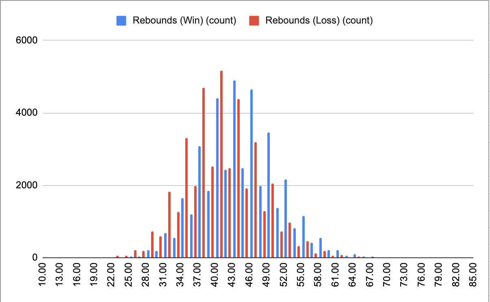
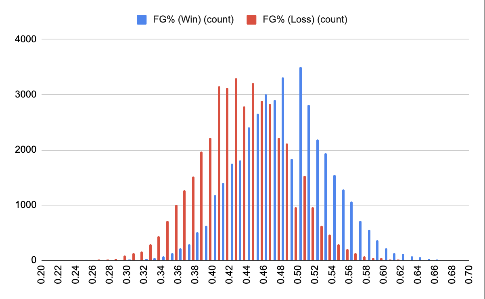
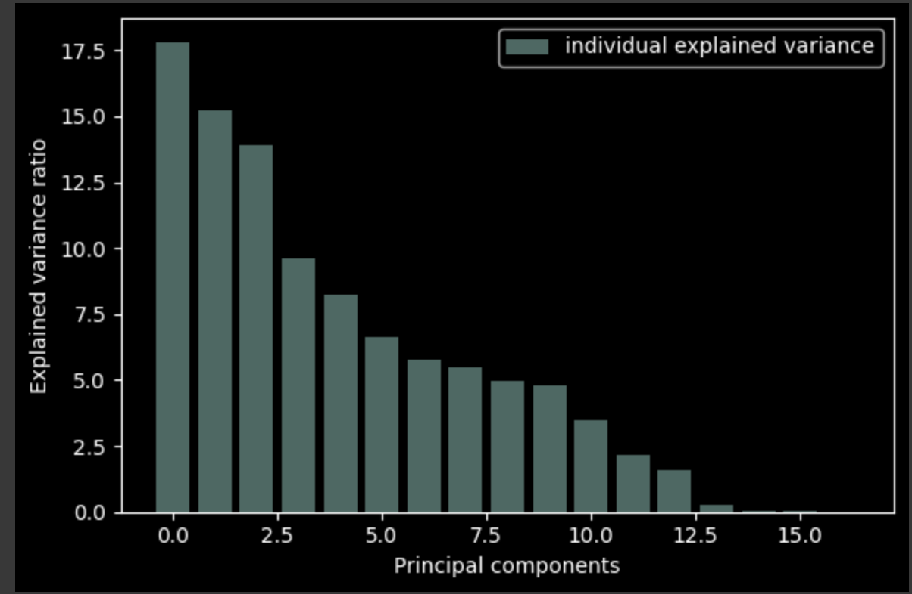
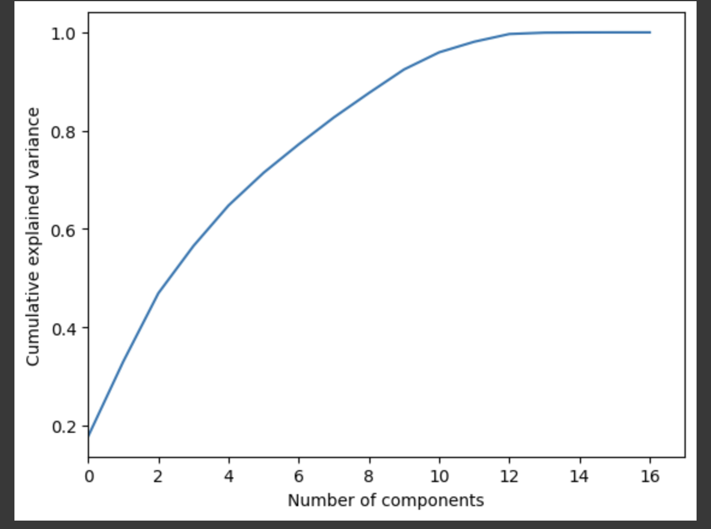

# Midterm

## Introduction/Background:

Our team is building a model to predict the outcome of NBA basketball games. More specifically, we will use data from past NBA seasons to predict the winner of a particular match-up on a certain day. The best published models in this problem space have been able to achieve within the range of 65-75% accuracy, so we will aim to reach 65% accuracy of game predictions. We will use team features such as field goal percentage, ELO (overall rating of the team), and average win-loss rate over the past 10 games. We will be training the model using game statistics over past NBA seasons, as found in datasets on Kaggle as well as scraped from the web.

## Problem definition:

Data analytics and modeling has been incorporated within professional sports in order to maximize advantage. Decisions made throughout a basketball game are often influenced by these numbers and analytics, which could end up being the difference in the ultimate result of a game. Sports predictions (by analysts) is a growing industry where before every game, analysts will display a prediction as to who will win and the margin of victory. Legal betting platforms have also been expanding for years. An accurate model is imperative to predict games and quantify all metrics in a basketball game to ensure the betting process is fair. Hence, the usefulness of machine learning is only growing in sports.

## Data Collection

Originally, we were going to use a dataset that contained statistics for every NBA game from the past 18 seasons, but we found the number of features to be too limiting, with only 6 useful statistics for each game. Another dataset we found had every possible recorded statistic for every game in the 2017-2018 NBA season, but each game’s statistics were separated over the players that played in each game rather than the overall teams’ statistics. Eventually, we found a dataset that contained the same statistics as the 2017-2018 NBA season dataset, but the statistics were combined for each team. Additionally, this dataset contained all the statistics for every game played since the inaugural 1946 NBA season.

The dataset contains statistics for:

- Win (0 or 1)
- Field Goals Made
- Field Goals Attempted
- Field Goal Percentage
- 3 Pointers Made
- 3 Pointers Attempted
- 3 Pointer Percentage
- Free Throws Made
- Free Throws Attempted
- Free Throw Percentage
- Offensive Rebounds
- Defensive Rebounds
- Total Rebounds
- Assists
- Steals
- Blocks
- Turnovers
- Personal Fouls
- Points
- Plus Minus

## Data Cleaning

Since the dataset had both home and away team statistics for each game, the two teams’ statistics were on the same row. We separated the away team statistics and appended them to the rows for the home team statistics to fix this issue. Additionally, the three-point line wasn’t added to the NBA until 1979 and not consistently used until a few seasons after, much of our dataset was empty. We decided to eliminate these rows from our data since games from that era of the NBA would not represent basketball as it is today. Points, rebounding, and field goals would all be skewed with the inclusion of this data, affecting our predictions. As a result, we removed data from games before the 1985-1986 NBA season. Even since then, the sport has changed drastically, so we may consider separating the data into decades or only keeping data from more recent seasons to have more consistent data for our predictions.

## Feature Selection and Standardization

We standardized the data by running the StandardScaler method, which removes the mean for each feature and scales to unit variance. This StandardScaler method is included within the Sklearn library which ensures it is using industry standard techniques. We also removed certain columns from the dataset, such as plus minus and whether the team won or lost since these features would give away the results we are trying to find.

## Methods

### PCA For Feature Reduction (Unsupervised Learning)

We started off by loading the dataset and removing the fields that give away the results of a game including whether the home or away team won or a team’s plus minus for a game. Then we standardized the data and removed certain features to get a more accurate model, as described in the previous section. After this we made the covariance matrix, and used SVD to calculate eigenvectors and eigenvalues to represent the data. We grabbed the first 10 new components, which explained 95% of the variance. We chose 10 components because that was enough to explain over 90% of the variance. Lastly, we did the dot product of the original data by the eigenvectors to get the new dimensions compressed into 10 components that represent our data.

### Linear regression (Supervised Learning)

For our linear regression model, we wanted to predict the plus_minus (point differential) given a set of game stats. Therefore, we made the game stats our features (ie: free throws made, field goal percentage, etc) and the plus_minus as our labels
After fitting our model to our data, we got a mean squared error (MSE) value and an R2 value which we were able to use to determine the accuracy and performance of our model.
With all the features and PCA to reduce the dimensions to 10, we got:

- MSE of 58.72 and an R2 of 0.687 for the testing data
- MSE of 58.15 and an R2 of 0.689 for the training data
  Overall, while the model was not extremely accurate, we got good initial results and an idea of where to improve. We speak more about future steps and hypotheses for improvement in the Discussion section below

### Logistic Regression (Supervised Learning)

Using the features, we used logistic regression to predict the probability of a team winning a game.
We used the same set of features as the linear regression model and applied the same PCA for 10 dimensions as before. However, this time we used the win column as the label to determine given a set of stats what team won. Ultimately, we got an accuracy of 0.84 and f1 score of 0.84 for both the training and testing data which was a relatively good performance. To improve for future iterations, we will do more feature selection and use certain time frames of games since different eras had different playstyles. We will also use other classification techniques to see if another model (ie: SVM) is better.

## Results and Discussion

Using PCA, linear regression, and logistic regression methods gave us accuracy levels that can still be improved. After using PCA to reduce our 20 features to 10 features, we used linear regression to try to output a point differential value (labeled as plus/minus in the dataset) using inputs of game stats from one team in a particular game. When we observed the predictions, we saw that predictions were being made that were extremely unlikely outcomes. We saw the model predicting +/- values in the range of -100 to 100, meaning that it predicted teams to win by extremely high amounts – however, our training set had teams only winning by a maximum of 40. This means the model is clearly not fit correctly to the data, and it may need more information that is relevant to the problem.

We also tried to use logistic regression to classify each team performance as a winning or losing performance. While we’ve mentioned before that the best models in this field only classify games at 65-70% accuracy, our accuracy is still too low to be used. This may be due to parameters influencing when games become losses or wins.

We can increase the accuracy of our model with a variety of approaches. First, we can try to work with the features of our data, and add/remove data depending on how much it correlates with the labels we want to predict. In our dataset before PCA, we’ve included some derived features that rely on others, and removing these features may be useful. We can also test correlations using covariance matrix to see if any of these features aren’t useful for the model. We can better prepare the dataset by adding some statistics like momentum (such as win percentage over the past 10 games) to give the model more knowledge about who can win. We can also group our dataset into different eras of basketball, and train the model separately based on these eras, because basketball has changed throughout the past 50 years and different stats are more influential in the current era of basketball than in the 1970s, 1980s and 1990s respectively. Changing our dataset means we will also change our PCA output, and we can also experiment with taking different amounts of features from PCA.

In addition, we can experiment with different regression and classification models. Our analysis shows that as we increase the number of features from PCA to use with linear regression, it is still hard for the model to predict an accurate regression with the data we have given. We can try using SVD for classification, improving our logistic regression accuracy, and experimenting with other models.

## Visualizations

### Dataset

For the 2 diagrams above:
When running PCA, our 20 features were reduced to 11 features that still represented 99% of the data. We ran linear regression on different amounts of features from 4 to 11 and plotted the R2 accuracy and MSE for each regression. It’s shown that accuracy increased significantly from 4 to 6 eigenvectors, and reached its max around 9-11 eigenvectors. Because both the accuracy and MSE trail off, we know that accuracy has converged and we won’t really be able to get much more accurate from this model.

### PCA

### Accuracy for Logistic Regression

Train

Test

## Midterm Tasks

## References

- Original dataset (limited features): https://www.kaggle.com/datasets/nathanlauga/nba-games
- 2017-2018 season data: https://data.mendeley.com/datasets/x3p3fgym83/1
- Final dataset: https://www.kaggle.com/datasets/wyattowalsh/basketball
- Three point line added: https://www.nba.com/news/this-day-in-history-oct-12-the-first-3-point-field-goal
- PCA: https://towardsdatascience.com/principal-component-analysis-for-dimensionality-reduction-115a3d157bad
- https://www.kaggle.com/code/nirajvermafcb/principal-component-analysis-explained
- Linear Regression: https://scikit-learn.org/stable/auto_examples/linear_model/plot_ols.html
